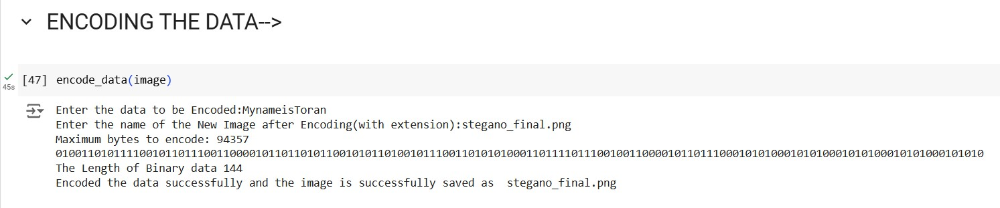
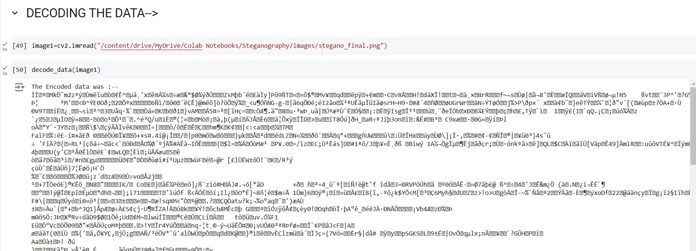
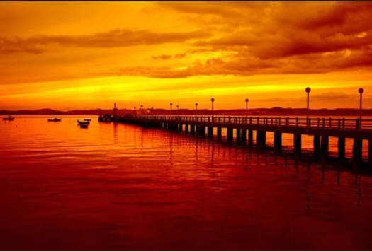
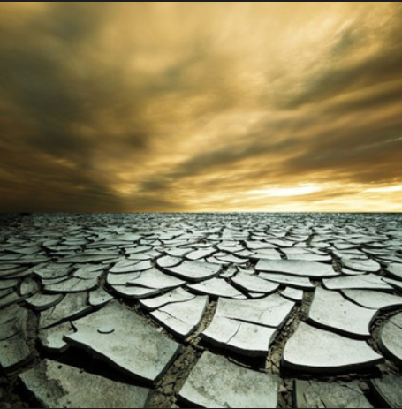
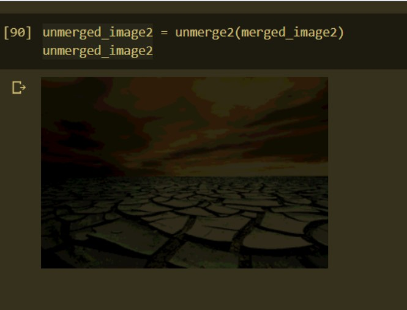

# Steganography

A steganography technique involves hiding sensitive information within an ordinary, non-secret file or message, so that it will not be detected. The sensitive information will then be extracted from the ordinary file or message at its destination, thus avoiding detection. Steganography is an additional step that can be used in conjunction with encryption in order to conceal or protect data.

## Project Links 

[Text Steganography](https://colab.research.google.com/drive/1BwrJDI4ZxJIs0U8p_VPsaWub7iBI1f1G#scrollTo=MgKT0KEmxJgj): Hiding Text Inside an Image.

[Image Steganography](https://colab.research.google.com/drive/1olDBDtKcBvtfTCyU7Dv6TtDu1BTPwtHE#scrollTo=XEkZE1OcX-PL): Hiding an Image inside an Image.


## Technologies Used
```
1. Open CV

2. Least Significant Bit Steganography

3. Python Imaging Library
```

## Advantage Over Cryptography

The advantage of steganography over cryptography alone is that the intended secret message does not attract attention to itself as an object of scrutiny. 

Plainly visible encrypted messages, no matter how unbreakable they are, arouse interest and may in themselves be incriminating in countries in which encryption is illegal.

## To Run

Run the respective ipynb file and in the place of image choose the image you want to choose..

### Incase of Text Steganography

Then run the encode_data function to encode the desired data.

After encoding the data run the decode_data function to decode the encoded data.

### Incase of Image Steganography

Run the merge2img2 function by selecting the images.

And then run the unmerge2 function to get the initial image after merging.

## Results
<br>
  
<br>


<br><br>

### These were the Images before and after encoding the data in Text Steganography:--
<br>

| Original Image | Image After Encoding |
| :---: | :---: |
|   |  |

<br>

### These were the images before and after encoding images in Image Steganography..
<br>
Image 1 is merged on Image 2..

| Cover Image | Image to be Merged |
| :---: | :---: |
|  |   |

<br>

| Merged Image | Unmerged Image |
| :---: | :---: |
|  |   |


## Author 
```
Toran V Athani
```

